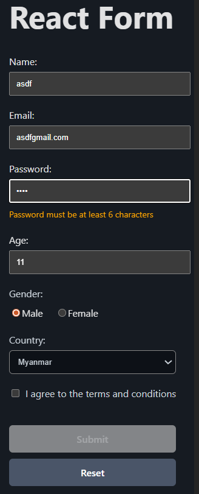
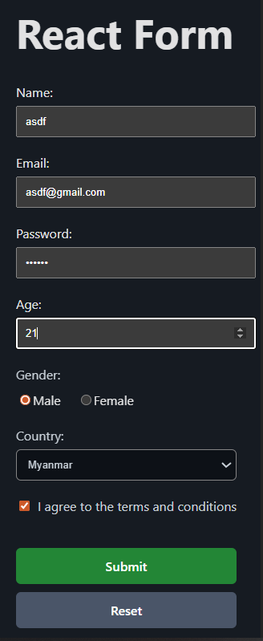

### 2. For React Form Project (`react-forms`)

````markdown
# React Controlled Form

A multi-field controlled form built with React + Vite, featuring real-time validation, loading state, error handling, and submitted data display.

## Live Demo

https://agmyathtun.github.io/react-forms/

## Features

- Controlled inputs (text, email, password, number)
- Radio buttons (gender)
- Select dropdown (country)
- Checkbox (terms agreement)
- Real-time validation & error messages
- Password strength hint while typing
- Submit button disabled when invalid
- Loading state ("Submitting...") with fake delay
- Success feedback + submitted data displayed on page
- Form reset button

## Tech Stack

- React 18
- Vite
- useState for form state & errors
- Controlled components
- Form validation logic
- Async submit with try/catch/finally
- GitHub Pages deployment

## Screenshots

### Form with Validation Errors



### Submitted Data Displays



## How to Run Locally

```bash
git clone https://github.com/Agmyathtun/react-forms.git
cd react-forms
npm install
npm run dev
```
````
